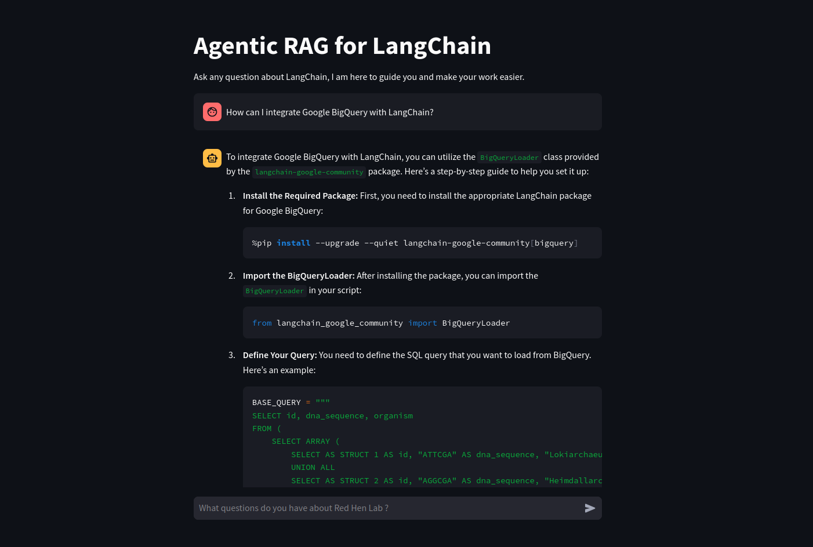

# Talk-to-any-Website-LLM

This project uses the open-source **crawl4AI** web crawler (inspired by [Ottomator Agents](https://github.com/coleam00/ottomator-agents/tree/main/crawl4AI-agent)) to extract and convert website data into markdown. The markdown data is then stored in a **RAG database** powered by **Supabase** for efficient retrieval. The system leverages **OpenAI GPT-4o-mini** as the LLM and features a **Streamlit**-based chat interface for querying the data.

For this implementation, I specifically crawled the [LangChain](https://python.langchain.com/docs/introduction/) documentation to demonstrate its effectiveness.

In the image, you can see that Agentic RAG provides better results for Red Hen Lab compared to ChatGPT. It also delivers more recent information retrieving it from the database that ChatGPT cannot.
